# RolloutProof 초기 기획서

> 문서 상태: Revision 3 — 9/10 Utility Target  
> 작성일: 2026-08-18  
> 관련 문서: [문서 안내](./README.md), [제품 스펙](./product-spec.md), [엔지니어링 구현 스펙](./implementation-spec.md), [오픈소스 벤치마킹](./benchmarking.md), [실제 효용성 평가](./utility-evaluation.md)

## 1. 프로젝트 개요

`rollout-proof`는 Kubernetes Deployment의 RollingUpdate 중 서비스 연속성을 능동적으로 검증하거나 읽기 전용으로 관찰하고, 요청 실패를 Pod 및 EndpointSlice lifecycle event와 연결해 증거와 가능한 원인을 제시하는 오픈소스 CLI다.

일반적인 `kubectl rollout status`는 Kubernetes가 rollout을 완료했는지만 알려준다. Deployment가 Available 상태를 유지하더라도 Pod 종료, readiness 전환, endpoint 변경 전파, 애플리케이션 connection draining 사이의 시간 차이로 5xx, timeout 또는 connection reset이 발생할 수 있다.

`rollout-proof`는 이 짧은 실패 구간을 재현하고, 다음과 같은 증거를 제공하는 것을 목표로 한다.

```text
VERDICT: FAILED

2,418 requests over 121.4s
15 failures during a 3.75s window

Evidence:
  12:00:06.120  old Pod entered Terminating
  12:00:06.121  first connection reset
  12:00:09.874  old endpoint became unready
  12:00:09.881  requests recovered

Finding:
  Traffic reached a terminating Pod for approximately 3.75s.
```

### 이번 개정의 핵심 결정

- 제품의 중심 명령을 `gate --wait-for-revision`으로 정한다.
- 사용자는 Go 단일 binary 하나만 설치한다.
- 기본 실행은 agentless이며 상시 controller, CRD, database를 요구하지 않는다.
- External probe를 MVP-A의 기본값으로 사용한다.
- In-cluster probe는 선택적 ephemeral Pod 방식의 MVP-B로 분리한다.
- 새 연결과 Keep-Alive 연결을 구분해 rollout 문제 탐지력을 높인다.
- Internal/External 동시 probe로 장애 계층을 좁히되 MVP-A에는 포함하지 않는다.
- `analyze`, Prometheus, OTel, eBPF는 초기 핵심 범위에서 제외한다.
- 9점 효용성을 위해 Profile, multi-probe, CI artifact, `explain`, report diff를 단계적으로 제공한다.
- 기술 범위를 넓히기보다 설치, 반복 사용, 비교 및 조치 가능성을 강화한다.

## 2. 제품 정의

### 2.1 핵심 문장

> Kubernetes Deployment의 rolling update 중 서비스 연속성을 능동적으로 검증하거나 읽기 전용으로 관찰하고, 요청 실패와 workload lifecycle의 상관관계를 제공하는 lifecycle verifier.

짧은 영문 설명은 다음과 같다.

> Evidence-driven zero-downtime verifier for Kubernetes Deployments.

### 2.2 핵심 가치

1. 통제된 synthetic traffic으로 배포 전후의 서비스 연속성을 검증한다.
2. 실패 시점을 Kubernetes lifecycle과 연결한다.
3. 설정 유무가 아니라 관측된 증거를 기반으로 설명한다.
4. 일반 Deployment에서 별도 controller 없이 동작한다.
5. Local, Preview, Staging 및 Production에서 위험도에 맞는 실행 모드를 제공한다.
6. 로컬 CLI와 CI/CD에서 일관된 report schema를 제공한다.

### 2.3 제품 경계

`rollout-proof`는 새로운 배포 전략을 제공하거나 배포 과정을 대신 제어하지 않는다.

- Argo Rollouts처럼 Rollout CRD를 제공하지 않는다.
- Flagger처럼 Canary traffic shifting을 수행하지 않는다.
- k6처럼 범용 부하 테스트 도구를 목표로 하지 않는다.
- LitmusChaos처럼 범용 장애 주입 플랫폼을 목표로 하지 않는다.
- 초기 버전에서는 자동 rollback이나 자동 manifest 수정을 수행하지 않는다.

제품의 역할은 기존 RollingUpdate를 관찰하고 검증하는 것이다. 실행 환경을 staging으로 제한하지 않으며, 환경별로 허용되는 상태 변경과 판정 언어를 구분한다.

## 3. 해결하려는 문제

### 3.1 현재 상태

일반적인 Kubernetes 배포 파이프라인은 다음 조건을 성공 기준으로 사용한다.

- Deployment가 Progressing 상태인지 확인
- desired replica와 available replica가 일치하는지 확인
- readiness probe 통과 여부 확인
- `kubectl rollout status` 성공 여부 확인

이 조건들은 Kubernetes resource 상태는 보여주지만 사용자 요청의 연속성을 보장하지 않는다.

### 3.2 대표적인 실패 원인

- readiness probe가 실제 서비스 준비보다 일찍 성공함
- 애플리케이션이 SIGTERM 직후 listener를 닫음
- EndpointSlice 변경이 실제 data plane에 늦게 전파됨
- `preStop` 시간이 endpoint 전파 시간보다 짧음
- `terminationGracePeriodSeconds`가 connection drain에 부족함
- replica 수와 `maxUnavailable` 조합이 가용성 목표를 충족하지 못함
- long-running request가 종료 과정에서 강제로 중단됨

### 3.3 사용자에게 필요한 답

단순히 “rollout이 실패했다”가 아니라 다음 질문에 답해야 한다.

- rollout 중 실제 요청이 몇 건 실패했는가?
- 어떤 유형의 오류였는가?
- 실패가 시작되고 끝난 정확한 시간은 언제인가?
- 당시 어떤 Pod와 endpoint가 생성 또는 종료되고 있었는가?
- rollout 이전에도 발생하던 오류인가?
- 관측된 증거로 볼 때 가장 가능성 높은 원인은 무엇인가?
- 사용자가 다음으로 확인하거나 변경해야 할 설정은 무엇인가?

## 4. 목표 사용자

### 4.1 1차 사용자: 애플리케이션 개발자

- 배포 중 간헐적인 502 또는 connection reset을 재현하려는 개발자
- readiness와 graceful shutdown 구현을 검증하려는 개발자
- Spring Boot, Node.js, Go 등 애플리케이션의 종료 동작을 local, preview 또는 staging에서 확인하려는 개발자
- PR 또는 release pipeline에서 무중단 여부를 자동 검사하려는 개발자

### 4.2 2차 사용자: 플랫폼 엔지니어와 SRE

- 여러 개발팀에 공통 Deployment 품질 기준을 제공하려는 플랫폼 팀
- 배포 중 발생하는 짧은 오류를 evidence와 함께 분석하려는 SRE
- 비운영 환경에는 능동 rollout gate를, production에는 read-only rollout 관찰을 제공하려는 운영 조직
- Kubernetes, CNI 또는 Service routing 환경별 전파 특성을 비교하려는 엔지니어

### 4.3 초기 대상에서 제외하는 사용자

- Canary 및 Blue/Green 배포 플랫폼을 찾는 사용자
- 대규모 성능 및 capacity test가 필요한 사용자
- 자동 rollback 시스템을 원하는 사용자
- cluster autoscaling이나 node scaling을 검증하려는 사용자

## 5. 핵심 사용 시나리오

### 5.1 Release-time Rollout Gate

가장 중요한 사용자 workflow다. 도구가 먼저 baseline과 watch를 시작하고 새로운 Deployment revision을 기다린다.

```bash
rollout-proof gate deployment/api \
  --url https://api.example.com/health \
  --wait-for-revision 5m
```

이후 Argo CD, Flux, Helm 또는 사내 CD 시스템이 rollout을 수행한다. `rollout-proof`는 기존 배포 방식을 변경하지 않고 전체 rollout과 settle window를 관찰한다.

### 5.2 개발자가 새 이미지의 종료 동작 검증

```bash
rollout-proof verify deployment/api \
  --service api \
  --image api=ghcr.io/example/api:v2 \
  --rps 20
```

도구는 baseline traffic을 측정하고, Kubernetes lifecycle watch를 시작한 뒤 image를 변경한다. rollout 완료 후 안정화 구간까지 요청을 지속하고 PASS/FAIL을 출력한다.

### 5.3 기존 CD 시스템의 rollout 관찰

```bash
rollout-proof gate deployment/api \
  --url https://api.example.com/health \
  --wait-for-revision 5m
```

Argo CD, Flux, Helm 또는 사내 CD 시스템이 rollout을 수행한다. `rollout-proof`는 이를 변경하지 않고 관찰한다.

### 5.4 연결 유형별 검증

새 TCP connection과 재사용 Keep-Alive connection을 분리해 관찰한다.

```bash
rollout-proof gate deployment/api \
  --url https://api.example.com/health \
  --connection-mode new,keep-alive
```

이를 통해 endpoint 전파 문제와 기존 connection draining 문제를 구분할 수 있다.

### 5.5 CI quality gate

```bash
rollout-proof verify deployment/api \
  --service api \
  --image api="${CANDIDATE_IMAGE}" \
  --output json \
  --max-errors 0
```

- PASS: exit code `0`
- 검증 실패: exit code `1`
- 실행 환경 또는 권한 오류: 별도의 non-zero exit code
- 판정 불가: FAIL과 구분되는 상태 및 exit code

### 5.6 변경 없이 현재 위험 확인

향후 read-only inspect 기능을 통해 현재 Deployment의 lifecycle 관련 설정과 관찰 가능한 상태를 확인한다.

```bash
rollout-proof inspect deployment/api --service api
```

정적 설정만으로 무중단을 보장하지 않으며, 실제 검증을 권장하는 preflight 기능으로 제한한다.

## 6. 동작 흐름

```mermaid
flowchart LR
    A["대상 Deployment와 Probe URL 확인"] --> B["HTTP baseline 측정"]
    B --> C["Kubernetes Watch 시작"]
    C --> D["지속적인 테스트 요청 시작"]
    D --> E["Rollout 실행 또는 외부 Rollout 감지"]
    E --> F["Deployment·Pod·EndpointSlice 이벤트 수집"]
    F --> G["Rollout 완료 및 안정화 구간 대기"]
    G --> H["요청과 Lifecycle 이벤트 상관분석"]
    H --> I["PASS·FAIL·INCONCLUSIVE 리포트"]
```



### 6.1 대상 발견

Deployment를 기준으로 관련 리소스를 탐색한다.

```text
Deployment
  └─ ReplicaSets
      └─ Pods

Service
  └─ EndpointSlices
      └─ Pod endpoints
```

Service는 selector를 기준으로 자동 추론한다. 후보가 없거나 여러 개라면 사용자가 `--service`로 지정하도록 한다.

### 6.2 Baseline 측정

rollout 이전에 짧은 요청 구간을 측정한다. baseline부터 실패한다면 rollout 때문에 발생한 문제라고 판정할 수 없다.

```text
VERDICT: INCONCLUSIVE

The target failed 4 of 100 baseline requests before the rollout.
Fix the existing service instability or explicitly allow baseline errors.
```

### 6.3 Rollout 관찰

다음 Kubernetes 리소스를 Watch API로 관찰한다.

- Deployment
- ReplicaSet
- Pod
- Event
- EndpointSlice

### 6.4 안정화 구간

Deployment가 완료된 직후에도 endpoint 및 network 변경이 남아 있을 수 있다. rollout 완료 후 configurable settle duration 동안 요청과 watch를 계속한다.

## 7. 실행 모드와 환경 모델

환경 이름이 아니라 작업의 위험도로 모드를 구분한다.

| 모드 | 상태 변경 | Traffic | 주요 환경 | 목적 |
|---|---:|---:|---|---|
| `gate` | 없음 | 선택적 Synthetic | Staging, Production, 모든 CD 환경 | 새 revision을 기다려 rollout 전체 관찰 |
| `verify` | 있음 | Synthetic | Local, Preview, Staging, 격리된 Canary | 배포 전 능동 검증 |
| `observe` | 없음 | 선택적 Synthetic | Staging, Production | 진행 중 rollout 관찰 |
| `analyze` | 없음 | 기존 telemetry 사용 | 모든 환경, 사후 분석 | 실제 metric/log/event 상관분석 |
| `inspect` | 없음 | 없음 | 모든 환경 | 사전 설정 및 권한 점검 |

### 7.1 Gate 모드

제품의 기본 workflow다. 현재 revision과 baseline을 기록한 뒤 새로운 revision을 기다린다.

- Deployment를 변경하지 않음
- Rollout 시작 전부터 watch와 probe 준비
- 외부 CD 시스템과 동작
- Release artifact용 report 생성
- Production에서 read-only Kubernetes 권한으로 실행 가능

### 7.2 Verify 모드

도구가 지정된 container image를 변경해 rollout을 발생시킨다.

- 명시적인 `--image` 옵션 필요
- Deployment patch 권한 필요
- 실행 전 대상과 변경 내용을 표시
- 자동 rollback은 수행하지 않음
- Local, Preview, Staging 및 격리된 production canary에서 사용
- 일반 production workload에서는 기본적으로 권장하지 않음

### 7.3 Observe 모드

기본 모드이며 read-only로 동작한다.

- 외부 시스템의 rollout 감지
- Kubernetes resource 및 HTTP 결과 관찰
- Deployment patch 권한 불필요
- Argo CD, Flux, Helm 및 사내 CD 도구와 결합 가능
- In-cluster Service 또는 external URL에 제한된 synthetic request 전송 가능
- Staging뿐 아니라 Production에서도 사용 가능

Production에서는 낮은 기본 RPS, GET/HEAD 요청, 전체 요청 수 및 timeout 제한을 적용한다.

### 7.4 Analyze 모드

Phase 3 이후 검토하는 수동 분석 모드다. 도구가 요청을 생성하지 않고 기존 telemetry와 저장된 lifecycle event를 결합한다.

입력 후보:

- Prometheus HTTP success/error metric
- Ingress 또는 Envoy access log
- Istio/Service Mesh metric
- OpenTelemetry trace
- 애플리케이션 access log
- 이전 `rollout-proof` JSON report

Production의 실제 사용자 traffic과 rollout의 상관관계를 분석하는 장기 방향이지만, MVP에서는 구현하지 않는다.

### 7.5 Inspect 모드

후속 범위로 두되 CLI 구조에는 반영한다.

- 현재 설정의 정적 risk 검사
- 관련 Service와 EndpointSlice 발견 결과 출력
- 필요한 RBAC과 검증 가능 여부 확인
- 실제 무중단 보장 대신 preflight 정보 제공

## 8. MVP 기능 범위와 설치 모델

### 8.1 MVP-A: Agentless Gate

- Kubernetes `apps/v1` Deployment
- RollingUpdate strategy
- HTTP/1.1
- External URL probe
- Local kind, Preview, Staging 및 Production cluster
- `gate --wait-for-revision`
- `observe` 모드
- `verify` 모드
- Production-safe read-only observation
- image 변경에 의한 rollout
- 지속적인 HTTP request 생성
- 새 연결 및 Keep-Alive connection profile
- HTTP status, latency, timeout, connection reset 기록
- Deployment, ReplicaSet, Pod, Event, EndpointSlice watch
- lifecycle timeline 생성
- baseline, rollout, settle 구간 구분
- Verify의 PASS/FAIL/INCONCLUSIVE와 Observe의 DEGRADATION OBSERVED 판정
- 관측 범위 및 confidence 표시
- 실행 중 Live timeline
- `explain`을 통한 판정 근거 재출력
- terminal 및 JSON 출력
- CI용 exit code
- Linux 및 macOS 단일 binary

사용자 설치는 다음 중 하나로 끝나야 한다.

```bash
brew install rollout-proof
```

```bash
curl -fsSL https://rollout-proof.dev/install.sh | sh
```

### 8.2 MVP-A Adoption: 반복 사용과 팀 적용

Core가 안정화된 뒤 설치 복잡도를 늘리지 않는 채택 기능을 추가한다.

- 선택적 `.rollout-proof.yaml` policy profile
- 여러 개의 안전한 GET/HEAD probe endpoint
- CLI option, config, annotation, 자동 발견의 명확한 우선순위
- Markdown 및 JUnit report
- GitHub Job Summary와 report artifact
- 공식 GitHub Action
- 공식 container image
- Deployment annotation 기반 선택적 zero-config
- Secret 환경변수 주입과 report redaction

대표 실행은 짧게 유지한다.

```bash
rollout-proof gate deployment/api
```

### 8.3 MVP-B: 선택적 In-cluster Probe

MVP-A 검증 후 추가한다.

- Service 및 port 자동 발견
- 임시 probe Pod 생성과 자동 삭제
- ClusterIP 내부 경로 검사
- Internal/External 동시 probe
- 경로별 실패 비교 및 조사 계층 제안
- Probe용 추가 RBAC 사전 검사
- Session label, deadline 및 orphan cleanup

Ephemeral probe는 별도 설치가 아니지만 Pod 생성·삭제가 발생하므로 완전한 read-only가 아니다. Production에서는 명시적인 `--allow-ephemeral-probe`가 필요하다.

### 8.4 초기 제외 범위

- Canary 및 Blue/Green 배포 제어
- 자동 rollback
- CRD 또는 상시 실행 controller
- Service Mesh traffic shifting
- gRPC, WebSocket, SSE 및 long-lived streaming
- HTTP/2 전용 분석
- 멀티클러스터
- Prometheus 필수 연동
- `analyze` 모드 및 외부 telemetry adapter
- cloud load balancer별 분석
- 범용 성능 테스트
- AI 기반 원인 분석
- 자동 manifest 수정

## 9. 데이터 수집 모델

### 9.1 HTTP 요청 기록

각 요청에 다음 정보를 기록한다.

- 요청 ID
- 시작 및 종료 timestamp
- latency
- HTTP status
- DNS, TCP, TLS, HTTP 단계 오류
- timeout 또는 connection reset 여부
- 가능하면 응답한 backend Pod identity

### 9.2 Kubernetes event 정규화

서로 다른 resource event를 공통 timeline event로 변환한다.

```text
TimelineEvent
  timestamp
  source
  resourceKind
  namespace
  resourceName
  podUID
  eventType
  attributes
```

중요 event 유형은 다음과 같다.

- rollout generation changed
- ReplicaSet created/scaled
- Pod created/scheduled/ready/unready
- Pod deletion started
- container terminated
- endpoint added
- endpoint ready/serving/terminating changed
- endpoint removed
- rollout completed/failed
- HTTP request succeeded/failed

### 9.3 시간 처리

HTTP 요청은 로컬 monotonic clock을 이용해 순서를 보존한다. Kubernetes object timestamp와 local observation timestamp를 함께 기록한다. 클러스터와 실행 머신의 clock skew 가능성을 리포트 metadata에 표시한다.

## 10. 판정 모델

### 10.1 기본 성공 조건

- baseline이 안정적임
- rollout이 제한 시간 안에 완료됨
- rollout 및 settle window 중 허용 범위를 초과하는 요청 실패가 없음
- 최소 요청 수가 충족됨

### 10.2 기본 실패 조건

- 허용하지 않은 HTTP status 발생
- timeout 또는 connection reset 발생
- Deployment rollout 실패 또는 timeout
- available replica가 사용자 설정 기준 아래로 하락

### 10.3 판정 불가 조건

- baseline부터 불안정함
- 필요한 resource를 발견할 수 없음
- 테스트 요청 수가 너무 적음
- watch connection이 장시간 단절되어 timeline 신뢰성이 낮음
- 실행 중 필요한 권한을 잃음

### 10.4 사용자 설정

```bash
--success-status 200-399
--max-errors 0
--request-timeout 2s
--baseline-duration 10s
--settle-duration 10s
--rollout-timeout 5m
--rps 20
```

### 10.5 모드별 판정 언어

통제 수준이 다르므로 모든 환경에서 동일한 의미의 `FAIL`을 사용하지 않는다.

Verify 모드:

```text
VERIFICATION: FAILED

15 of 2,418 controlled requests failed during the test rollout.
```

Observe 모드:

```text
DEGRADATION OBSERVED

The external probe recorded 15 failures during the rollout.
```

Analyze 모드:

```text
ROLLOUT-CORRELATED DEGRADATION

The HTTP 5xx rate increased during the rollout.
This is correlation, not confirmed causation.
```

### 10.6 Policy Profile과 설정 우선순위

팀별 기준은 선택적 설정 파일로 관리한다.

```yaml
profile: production-http

probes:
  - name: health
    url: https://api.example.com/health
  - name: product-read
    url: https://api.example.com/products/known-item
    headers:
      Authorization: ${PROBE_TOKEN}

traffic:
  rps: 5
  connectionModes: [new, keep-alive]

policy:
  allowedStatuses: [200, 204]
  maxErrors: 0
  maxConnectionResets: 0
  minimumRequests: 500

observation:
  baselineDuration: 15s
  settleDuration: 20s
```

설정 우선순위는 다음과 같다.

```text
CLI option
  > .rollout-proof.yaml
  > Deployment annotation
  > auto-discovery
  > built-in safe default
```

Manifest annotation은 선택 기능이며 도구 사용의 필수 조건이 아니다.

### 10.7 Report, Explain, Diff

모든 실행은 versioned JSON report를 기준 artifact로 생성한다.

```bash
rollout-proof explain report.json
rollout-proof diff previous.json current.json
```

`explain`은 판정 규칙과 evidence를 재출력한다. `diff`는 오류 수, connection reset, rollout duration, Pod readiness 및 endpoint transition의 regression을 비교한다.

Report diff는 서버나 database 없이 파일 두 개만으로 동작해야 한다.

## 11. 원인 분석 모델

초기 버전은 AI가 아닌 규칙 기반 분석을 사용한다. 모든 finding에는 근거와 신뢰도를 포함한다.

| 관측 결과 | 가능한 finding |
|---|---|
| 신규 Pod가 Ready가 된 직후 요청 실패 | readiness가 실제 준비 상태보다 빠름 |
| 기존 Pod 삭제 직후부터 endpoint 제거 전까지 실패 | shutdown과 endpoint 전파 사이의 공백 |
| endpoint 제거 후 기존 연결만 실패 | connection draining 부족 |
| grace period 종료 시점에 실패 증가 | 강제 종료 또는 grace period 부족 |
| Available replica가 0인 구간 존재 | replica 또는 RollingUpdate strategy 문제 |
| rollout 이전에도 유사한 오류율 | rollout과 무관한 baseline 문제 |

예상 출력:

```text
Finding: endpoint propagation gap
Confidence: high

Evidence:
- failures began 11ms after Pod termination started
- failures stopped 7ms after endpoint removal was observed
- baseline failure rate was 0%
```

확인할 수 없는 정보는 추측하지 않는다.

```text
SIGTERM delivery time: unknown
Reason: application instrumentation was not enabled
```

## 12. 기술 아키텍처

### 12.1 기본 원칙

- Go 단일 binary
- 외부 database 없음
- 클러스터에 CRD 설치 없음
- 기본 read-only
- Kubernetes API와 HTTP 관찰 데이터만으로 핵심 기능 수행
- report format은 추후 도구가 소비할 수 있도록 versioned schema 사용
- 기본 동작은 agentless external probe
- In-cluster probe는 요청 시에만 생성되는 ephemeral Pod

### 12.2 권장 패키지 구조

```text
cmd/
  rollout-proof/
internal/
  discovery/      # Deployment-Service-Pod 관계 탐색
  watcher/        # Kubernetes Watch API
  traffic/        # HTTP request generator
  probe/          # External 및 optional ephemeral probe
  timeline/       # Event 정규화 및 시간 정렬
  analyzer/       # 규칙 기반 상관분석
  report/         # Terminal 및 JSON 출력
  runner/         # Gate/Observe/Verify orchestration
pkg/
  model/          # 공개 event/report 타입
```

### 12.3 Controller를 사용하지 않는 이유

- 설치와 제거가 간단함
- 클러스터에 새로운 CRD가 필요 없음
- 로컬과 CI에서 동일하게 실행 가능
- 보안 및 운영 검토 범위가 작음
- 기존 배포 플랫폼과 느슨하게 결합 가능

상시 검증 요구가 확인되기 전까지 controller는 도입하지 않는다.

### 12.4 설치 및 배포 원칙

- Homebrew, release binary, install script 및 `go install` 제공
- 첫 실행에 설정 파일을 요구하지 않음
- 현재 kubeconfig와 context 자동 사용
- Server component와 database 없음
- Optional probe image는 CLI와 동일한 version 사용
- Probe image가 필요하지 않은 기능은 registry 접근 없이 동작

## 13. 권한 모델

### 13.1 Observe 모드

필요한 read 권한:

- Deployments
- ReplicaSets
- Pods
- Services
- EndpointSlices
- Events

각 resource에 대해 `get`, `list`, `watch` 권한이 필요하다.

External probe는 추가 Kubernetes 쓰기 권한이 필요 없다.

### 13.2 Verify 모드

Observe 권한에 다음 권한이 추가된다.

- 대상 Deployment `patch`

### 13.3 사전 권한 검사

시작 시 `SelfSubjectAccessReview`를 사용해 필요한 권한을 확인한다.

```text
Missing permission:
  patch apps/deployments in namespace staging

Observe mode is still available.
```

### 13.4 Ephemeral Probe 권한

Internal probe를 선택한 경우에만 대상 namespace의 Pod `create`, `get`, `watch`, `delete` 권한이 필요하다. 이 모드는 report에 mutation 사실을 기록하고 세션 종료 시 probe를 정리한다.

## 14. 안전성 원칙

- 기본 workflow는 read-only `gate`
- 변경 작업은 명시적 `verify` 명령에서만 수행
- Production의 기본 지원 방식은 read-only `gate` 또는 `observe`
- image 변경은 `--image` 지정 필수
- 실행 전 context, namespace, Deployment 및 변경 내용을 표시
- production으로 보이는 context에 경고 제공
- 최대 RPS에 안전한 기본값과 상한 제공
- Production observe에서는 낮은 기본 RPS와 GET/HEAD 요청만 허용
- 요청 timeout과 전체 요청 수에 상한 적용
- 자동 rollback하지 않음
- SIGINT를 받아도 현재까지 수집한 결과 저장
- Secret, authorization header 및 cookie를 report에서 제거
- baseline이 불안정하면 기본적으로 rollout을 시작하지 않음
- 실행 결과에 실제 수행한 변경을 audit section으로 기록
- Ephemeral probe는 session label과 deadline을 가져야 함
- Ctrl+C와 오류 종료에서도 probe cleanup을 시도함
- Cleanup 실패 시 정확한 resource 이름과 명령을 출력함

## 15. 기술적 위험과 대응

### 15.1 정확한 SIGTERM 시점

Kubernetes API만으로 컨테이너 프로세스가 SIGTERM을 받은 정확한 시점을 직접 알기 어렵다.

초기 대응:

- Pod deletion timestamp와 container termination state 수집
- 애플리케이션 로그 또는 response 변화는 선택적으로 활용
- 확인할 수 없는 시점은 `unknown`으로 표시

후속 검토:

- 선택적 application instrumentation
- test agent 또는 sidecar
- eBPF signal observation

### 15.2 Backend Pod 식별

Service를 통한 응답이 어느 Pod에서 왔는지 식별하려면 애플리케이션의 협조가 필요할 수 있다.

후보 방식:

- 응답 header에 Pod name 포함
- Downward API로 Pod name 전달
- 선택적 proxy/sidecar
- Service Mesh access log

MVP에서는 backend attribution 없이도 전체 failure window를 계산한다.

### 15.3 네트워크 구현 차이

kube-proxy iptables/IPVS, eBPF CNI, Ingress 및 Service Mesh에 따라 endpoint 전파가 다르다.

리포트 metadata에 다음 정보를 포함한다.

- Kubernetes version
- 감지 가능한 CNI 및 kube-proxy mode
- 요청 발생 위치
- Service/Ingress 경로
- node topology

### 15.4 Watch event 유실

resource version 만료, reconnect 및 API server 부하로 event가 누락될 수 있다.

- reconnect 및 resource version 처리
- 관찰 공백을 timeline에 명시
- 신뢰도에 영향을 주는 공백이면 INCONCLUSIVE 판정

## 16. 개발 단계

### Phase 0: 기술 가설 검증

목표:

> 정상 앱은 PASS하고, SIGTERM 직후 listener를 닫는 앱은 FAIL하며, 실패 요청이 Pod termination부터 endpoint 제거 사이에 발생했다는 timeline을 보여준다.

구현 범위:

- kind cluster
- 정상 종료 fixture
- 잘못된 종료 fixture
- HTTP request loop
- Pod 및 EndpointSlice watch
- terminal timeline

종료 기준:

- 두 fixture의 결과가 반복 실행에서 안정적으로 구분됨
- 실패 window가 Kubernetes lifecycle event와 함께 출력됨

### Phase 1: MVP-A Core

- `gate`, `observe`, `verify`
- Deployment, ReplicaSet 및 Pod 관계 자동 탐색
- baseline/rollout/settle 구간
- External HTTP traffic generator
- 새 연결/Keep-Alive profile
- 전체 Kubernetes watcher
- 모드별 판정: Verify의 PASS/FAIL/INCONCLUSIVE, Observe의 DEGRADATION OBSERVED
- 관측 범위 및 confidence
- Live timeline과 `explain`
- terminal 및 versioned JSON report
- kind E2E test
- Linux/macOS release binary
- GitHub Actions 사용 예제

### Phase 2: MVP-A Adoption

- `.rollout-proof.yaml` policy profile
- Multi GET/HEAD probe
- Deployment annotation 기반 선택적 설정
- Markdown/JUnit/GitHub Summary
- GitHub Action과 container image
- 인증 header와 TLS 설정
- Secret redaction

### Phase 3: In-cluster MVP-B

- Optional ephemeral probe Pod
- Internal/External 동시 probe
- 경로별 결과 비교
- Service/port zero-config discovery
- Probe cleanup 및 RBAC preflight
- response header 기반 backend attribution

### Phase 4: 비교와 협업

- `report diff`
- Baseline/candidate regression 비교
- 공유 가능한 redacted 진단 bundle
- Framework별 graceful shutdown guide
- 근거 기반 patch preview
- HTML timeline
- Helm/Kustomize 예제
- `kubectl rollout-proof` plugin 지원

### Phase 5: 선택적 확장

- `analyze` 명령
- Prometheus traffic metric adapter
- Ingress/access log import
- 저장된 lifecycle report의 사후 분석
- gRPC unary
- HTTP/2
- WebSocket 및 streaming
- Ingress/Gateway API
- Istio/Linkerd 환경
- Argo Rollouts/Flagger 관찰 adapter
- CNI별 분석 강화

## 17. 테스트 Fixture

프로젝트가 직접 재현 가능한 애플리케이션 fixture를 제공한다.

```text
fixtures/
  graceful/
  immediate-close/
  premature-readiness/
  insufficient-grace/
  unavailable-gap/
  long-request/
```

| Fixture | 목적 |
|---|---|
| graceful | 정상 graceful shutdown이 PASS하는지 검증 |
| immediate-close | SIGTERM 직후 listener 종료 문제 재현 |
| premature-readiness | 실제 준비보다 빠른 readiness 문제 재현 |
| insufficient-grace | grace period 부족 문제 재현 |
| unavailable-gap | replica/strategy 가용성 공백 재현 |
| long-request | 진행 중 요청 강제 종료 재현 |

Fixture는 회귀 테스트, 사용자 데모 및 문서 예제로 함께 사용한다.

## 18. 오픈소스 프로젝트 구성

초기 공개 시 다음 항목을 갖춘다.

- Apache-2.0 License
- README
- CONTRIBUTING
- CODE_OF_CONDUCT
- SECURITY
- 지원 Kubernetes version 정책
- Architecture 문서
- JSON report schema
- Roadmap
- 재현 가능한 quick-start demo
- Good first issue 후보

README 첫 화면에서는 설명보다 실패를 보여주는 짧은 terminal demo를 우선한다.

```text
$ rollout-proof verify deployment/api ...

FAILED — 12 requests were reset during a 2.84s endpoint propagation gap.
```

## 19. 성공 지표

### 19.1 기술 성공 지표

- 정상 fixture에서 반복적으로 false positive 없이 PASS
- 결함 fixture에서 반복적으로 실패 구간 탐지
- failure window와 lifecycle event의 일관된 상관관계
- watch reconnect 이후에도 report 생성
- CI에서 명확한 exit code 제공

### 19.2 사용자 가치 지표

- 사용자가 10분 이내에 기존 Deployment를 관찰할 수 있음
- 별도 CRD나 controller 설치 없이 실행 가능
- 실패 결과만 보고 다음 점검 위치를 이해할 수 있음
- CI에 하나의 명령으로 추가 가능
- 설정 파일 없이 첫 실행 가능
- 동일 profile로 로컬, staging 및 production gate 기준을 재사용 가능
- 이전 report와 현재 report의 regression을 서버 없이 비교 가능

### 19.3 초기 커뮤니티 지표

- 재현 가능한 bug report 템플릿 확보
- 서로 다른 언어 또는 framework fixture 기여
- 서로 다른 CNI 환경의 검증 결과 수집
- 외부 사용자의 실제 rollout failure 사례 확보

## 20. 의사결정 및 비목표

초기 단계에서 다음 결정을 고정한다.

| 항목 | 결정 |
|---|---|
| 구현 언어 | Go |
| 배포 형태 | 단일 CLI binary |
| 기본 workflow | Read-only `gate` |
| 핵심 명령 | `gate --wait-for-revision` |
| 기본 probe | Agentless external URL |
| 내부 probe | 선택적 ephemeral Pod, MVP-B |
| 환경 정책 | 모든 환경 지원, Production은 read-only gate/observe 우선 |
| 1차 workload | Kubernetes Deployment |
| 1차 probe 대상 | External HTTP URL |
| 2차 probe 대상 | ClusterIP Service, MVP-B |
| 1차 protocol | HTTP/1.1 |
| 핵심 결과 | Lifecycle timeline과 evidence-based finding |
| 분석 방식 | 투명한 규칙 기반 분석 |
| 클러스터 설치물 | 없음 |
| 설정 파일 | 선택 사항, 첫 실행에는 불필요 |
| 기준 artifact | Versioned JSON report |
| 채택 채널 | Binary, Homebrew, container, GitHub Action |
| 자동 rollback | 지원하지 않음 |
| Canary/Blue-Green | 지원하지 않음 |

## 21. MVP 완료 정의

다음 조건을 모두 충족하면 MVP가 완료된 것으로 본다.

1. 사용자가 kubeconfig, Deployment 및 external probe URL을 지정해 실행할 수 있다.
2. 도구가 rollout 전 baseline traffic을 측정한다.
3. `gate`, `observe` 또는 `verify` 방식으로 rollout을 추적한다.
4. Deployment, ReplicaSet, Pod 및 EndpointSlice event를 하나의 timeline으로 정리한다.
5. HTTP 실패를 rollout lifecycle event와 함께 보여준다.
6. Verify에서는 PASS, FAIL, INCONCLUSIVE를 구분하고 Observe에서는 관찰된 degradation을 검증 실패와 구분한다.
7. terminal과 JSON report를 생성한다.
8. 정상 및 결함 fixture를 kind E2E test로 검증한다.
9. CI에서 결과를 exit code로 사용할 수 있다.
10. 공개 README의 quick start만으로 데모를 재현할 수 있다.
11. Production context에서 `observe`가 Deployment patch 권한 없이 안전하게 실행된다.
12. `gate`가 baseline 이전부터 대기해 새로운 revision의 전체 rollout을 놓치지 않는다.
13. 설치에 Helm, CRD, controller 또는 database가 필요하지 않다.
14. Live timeline과 `explain`이 같은 evidence로 일관된 판정을 제공한다.
15. 선택적 profile로 여러 GET/HEAD probe와 connection policy를 재사용할 수 있다.
16. GitHub Action 또는 container로 로컬 설치 없이 동일한 gate를 실행할 수 있다.

## 22. 다음 작업

초기 기획 이후 다음 순서로 구체화한다.

1. [엔지니어링 구현 스펙](./implementation-spec.md)에 따라 Phase 0 기술 위험 검증
2. CLI command와 option specification 확정
3. Timeline event 및 JSON report schema 설계
4. 정상/결함 fixture의 최소 애플리케이션 작성
5. kind 기반 재현 실험
6. `gate --wait-for-revision` CD 통합 실험
7. Policy profile 및 multi-probe specification 작성
8. JSON, Markdown, JUnit report contract 정의
9. GitHub Action과 container 배포 방식 검증
10. `explain` 및 `report diff` 판정 일관성 테스트
11. 실험 결과에 따라 MVP 범위 재검토

가장 먼저 검증할 가설은 다음 하나다.

> 애플리케이션 요청 실패와 Pod/EndpointSlice event만으로 사용자가 이해할 수 있는 rollout failure timeline을 안정적으로 생성할 수 있는가?
